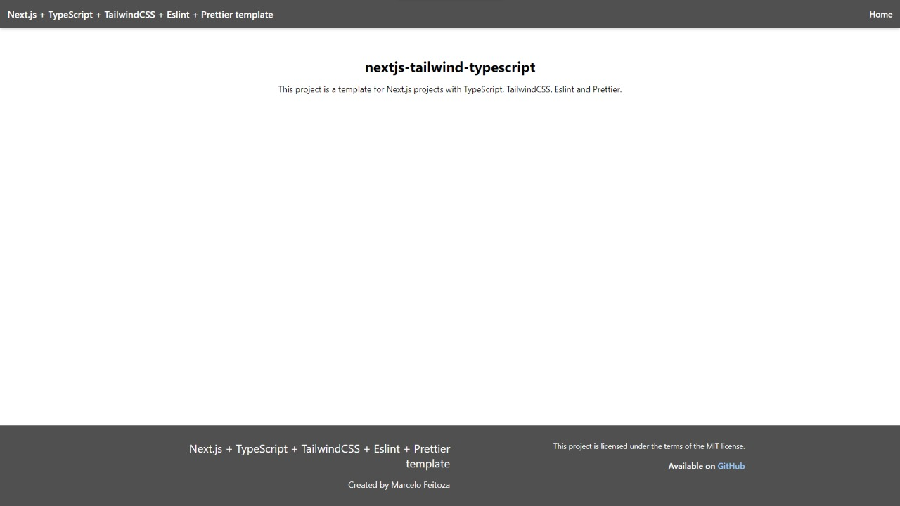

<div align="center">
  <h1>nextjs-tailwind-typescript</h1>
  <p>Next.js + Tailwind CSS + TypeScript template.</p>
  <p>Made by <a href="https://github.com/marcelofeitoza">Marcelo G Feitoza</a></p>
  
</div>



## Features

-   Next.js 13
-   React 18
-   TypeScript
-   Tailwind CSS
-   ESLint
-   Prettier
<!-- -   Absolute Import and Path Alias -->

## Getting Started

### 1. Use the template with create-next-app

Using `create-next-app`

```bash
npx create-next-app -e https://github.com/marcelofeitoza/nextjs-tailwind-typescript {project-name}
```

### 2. Install dependencies

Using **yarn** to install the dependencies:

```bash
yarn install
```

Using **npm run dev** to install the dependencies:

```bash
npm install
```

### 3. Run the development server

You can start the server using this command:

```bash
yarn dev
```

Usign **npm run dev** to start the server:

```bash
npm run dev
```

Open [http://localhost:3000](http://localhost:3000) with your browser and then you can start editing the page by modifying `/pages/index.tsx`.

